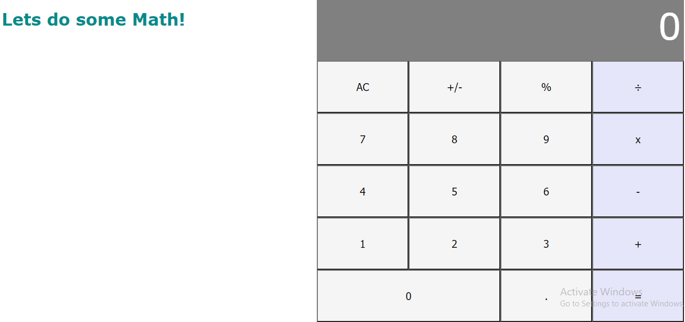

# Math-Magicians Calculator

Built a calculator for Math-magicians Inc using create-react-app. Math-magicians is a fictional company based in France. They have requested help to build a simple product that would assist them with their calculations.

## Heroku link
[live demo](https://leon-calc.herokuapp.com)

## Built with

- Node.js
- JavaScript
- React
- CSS
- ES6

## To get started
- Clone this repository onto your local machine and cd into its directory in your code editor.
- `$ git clone https://github.com/Leon-Mbegera/calculator.git`
- `$ cd calculator`

## Using dependencies
- Install packages needed:
- `$ npm install`

- run the below command to open and view the calculator website live on the browser
- `$ npm start`

## Testing
- To check the tests written, run:

- `npm test` on the terminal.

## Author

👤 **Leon**

- GitHub: [github](https://github.com/Leon-Mbegera)
- LinkedIn: [LinkedIn](https://www.linkedin.com/in/leon-mbegera)

## 🤝 Contributing

Contributions, issues and feature requests are welcome!

Feel free to check the [issues page](https://github.com/Leon-Mbegera/calculator/issues/).

## Show your support

Give a ⭐️ if you like this project!
